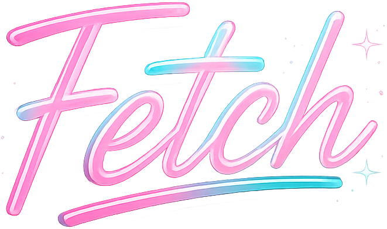
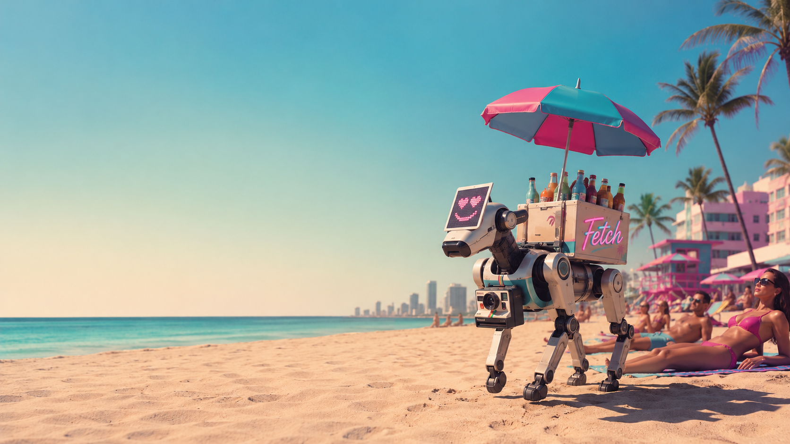
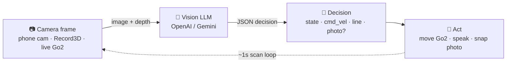
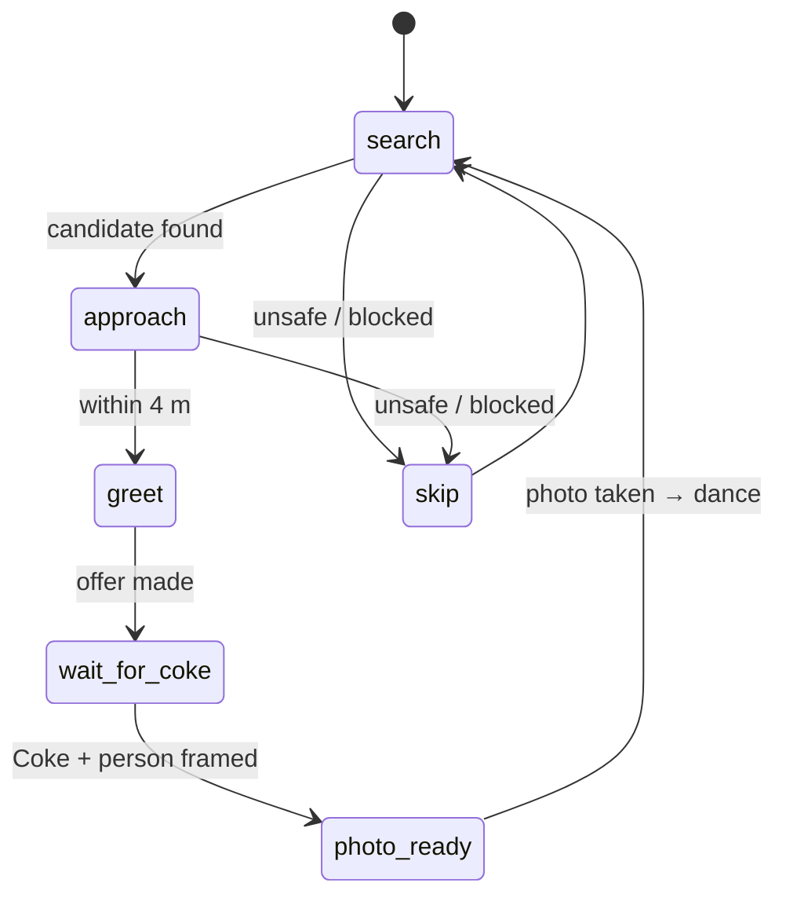

<div align="center">



# Fetch

**A vision-powered robot dog brand ambassador that trades ice-cold Cokes for opt-in beach photos.**

[](https://www.python.org/)
&nbsp;[](https://github.com/dimensionalOS/dimos)
&nbsp;[](https://fastapi.tiangolo.com/)
&nbsp;[](https://youtu.be/7-kzERfLwH0)

<br/>

[](https://youtu.be/7-kzERfLwH0)

<sub>▶ Click the image to watch the demo</sub>

<br/>

[🚀 Quickstart](#-quickstart-run-it-yourself) · [🧠 How it works](#-how-it-works-at-a-glance) · [💬 Voice](#-voice--conversation) · [🧰 Built with](#-built-with) · [🔧 Technical reference](#-technical-reference)

</div>

---

## 🐕 What it is

Fetch is a Unitree Go2 Air robot dog that turns a beach interaction into a branded
mini-experience. It roams the sand, finds someone who appears available from visible
context, trots over, waves, makes a personalized joke about the scene, and offers an
ice-cold Coke from its back. If the guest accepts, Fetch coaches them into frame,
takes an opt-in photo, and celebrates with a dance.

Under the hood, a vision LLM "reads the room" on every camera frame and returns
structured decisions: where to move, whether the person appears approachable, what to
say, when to stop, and when the Coke-and-guest photo is framed correctly. It runs as
a single FastAPI + WebSocket server, so you can try the whole behavior from a phone
browser **before any robot is involved**.

## 📈 The opportunity

Fetch is an autonomous **brand ambassador** and **mobile vendor**: a physical
character that can distribute product, create a memorable interaction, and turn an
ordinary handoff into an opt-in branded keepsake. In this demo, Fetch works as a
Coca-Cola ambassador. The longer-term vision is a fleet of robot-dog vendors that roam
beaches, parks, festivals, campuses, and resorts, then **self-resupply** at nearby
vendors or dedicated autonomous stations.

## 🏖️ Why a beach?

We started by brainstorming where a quadruped earns its keep, and kept landing on the
one thing robot dogs do that wheeled robots can't: **handle terrain**. So we framed
Fetch around adapting the Unitree Go2 to an environment most robots avoid.

We chose **sand** for a reason specific to this form factor. A quadruped's camera sits
low to the ground, so it spends most of its time looking *up* at standing people — an
awkward angle for face-to-face interaction. On a beach, people are usually sitting or
lying on the sand, which drops them into the dog's natural eye-line and makes the
human-robot interaction feel natural instead of stilted.

And the hardware path is real, not hypothetical: quadrupeds already run on sand (KAIST's
[RaiBo](https://techxplore.com/news/2023-01-raibo-versatile-robo-dog-sandy-beach.html)
sprints across a beach at 3 m/s), and [sand-walking foot
adaptations](https://www.popsci.com/technology/robot-moose/) — moose-inspired "booties"
— cut foot sinkage ~46% and walking energy up to ~70%. A real beach deployment is a
question of fitting the Go2, not inventing new science.

## 🎬 The experience

1. **Wakes up.** The dog runs its preflight (recovery stand → balance stand →
   joystick handoff) and starts looking around.
2. **Reads the room.** It turns in place scanning for a good guest: someone
   centered in frame, facing the dog, and appearing available from visible cues.
   People glued to a phone, laptop, or meal read as "busy — skip."
3. **Approaches — carefully.** If the path looks clear, it walks over and stops
   once the person is within ~4 meters.
4. **Breaks the ice.** It waves and delivers a personalized one-liner riffing on
   what's actually visible in the scene — never on who the person is.
5. **Makes the trade.** "Grab a Coke from my back, then pose for an instant photo."
   It coaches them to hold the Coke up and center themselves in frame.
6. **Takes the shot.** When the framing is right, it snaps the photo, shows it in a
   Fetch-branded photo card with a Polaroid print sound, tells them it's ready —
   and dances.

Fetch's comedy voice is confessional, observational, self-deprecating, and mildly
exasperated by the absurdity of being a tiny robot dog hauling soda around a beach.

## 🧠 How it works (at a glance)



Fetch reuses the **DimOS teleop web pattern**: a FastAPI server serves an HTTPS
phone UI, the phone streams camera frames over a WebSocket, and the server returns
motion / speech / photo decisions. Three camera sources plug into the same loop:

- **Phone browser camera** — zero hardware; the fastest way to try the behavior.
- **Record3D USB (RGBD)** — real iPhone LiDAR depth, since Safari won't expose raw
  depth to JavaScript.
- **Live Unitree Go2** — WebRTC camera + LiDAR over the dog's Wi-Fi.

## ⚡ Engineered for live interaction

The interaction only works if the timing feels human. A joke that arrives two seconds
late feels broken; a photo prompt that lags behind the guest's movement kills the
moment. So Fetch treats latency as core UX, not backend plumbing.

We benchmarked real round-trip latency across the vision and speech models Fetch can
use (`scripts/latency_bench.py`, hitting the live OpenAI / Gemini / Cartesia APIs),
including time-to-first-audio for streaming TTS. The live demo uses **Gemini 2.5
Flash-Lite** for per-frame vision and **Cartesia Sonic** for low-latency speech.
Camera frames are downscaled (≤640 px) and JPEG-compressed before they're sent for
analysis, keeping uploads and inference quick enough for the scan loop to land around
one second.

The audio path is tuned for the same reason. The server reuses the Cartesia HTTP client
to avoid a fresh TLS handshake on every line, supports runtime audio-provider switching
from the phone UI, and can route speech through `/speak`, Gemini Live TTS, or optional
OpenAI Realtime WebRTC depending on the demo setup. For two-way conversation, Fetch
uses a persistent Gemini Live session with server-side voice activity detection,
barge-in, tool calls, and camera feedback, so spoken coaching stays aligned with what
the robot can actually see.

## 🚀 Quickstart (run it yourself)

> [!IMPORTANT]
> **Setup:** this repo ships the Fetch code; DimOS supplies the framework pieces it
> imports (robot transport, message types, web server). DimOS is pinned to a **git
> commit** — the published PyPI release predates the web API this code uses — and it
> builds from source, so a C/C++ (and Rust) toolchain is required to install.

```bash
python -m venv .venv && source .venv/bin/activate
pip install -r requirements.txt
```

Set whichever provider keys you'll use in `.env`: `OPENAI_API_KEY`, `GEMINI_API_KEY`
(or `GOOGLE_API_KEY`), `CARTESIA_API_KEY`. Already running inside the DimOS monorepo?
Skip the install, keep the package on your `PYTHONPATH`, and run the commands below as
`python -m dimos.experimental.fetch.iphone_middleware` instead of `python iphone_middleware.py`.

> [!TIP]
> No robot required — start here with just a phone or laptop browser camera.

**1. No hardware — phone or laptop browser camera:**

```bash
python iphone_middleware.py --host 0.0.0.0 --port 8455
```

Open `https://127.0.0.1:8455/fetch` and tap **Record** to start the ~1-second scan
loop (accept the self-signed-cert warning). For local debugging you can add `--no-ssl`
and open `http://127.0.0.1:8455/fetch` instead — `localhost`/`127.0.0.1` count as
secure contexts so the camera still works; a phone-over-LAN demo needs HTTPS (the
default) or the browser blocks the camera/mic.

**2. Real iPhone LiDAR depth via Record3D USB:**

```bash
# start Record3D with USB streaming enabled and the red record toggle on, then:
python iphone_middleware.py --host 0.0.0.0 --port 8455 --record3d
```

**3. Live Unitree Go2 on the dog's Wi-Fi:**

```bash
python iphone_middleware.py \
  --host 0.0.0.0 --port 8455 \
  --vision-provider gemini \
  --robot-ip 192.168.12.1 --robot-connection-method local_ap
```

Vision defaults to **Gemini `gemini-3.5-flash`** through Gemini's OpenAI-compatible API
(no LangChain); pass `--vision-provider openai` to use OpenAI `gpt-5-mini` instead. For
the lowest latency, our live demo runs vision on **Gemini 2.5 Flash-Lite**
(`--model gemini-2.5-flash-lite`). Use `--no-ssl` for quick local debugging.

## 💬 Voice & conversation

Fetch can either **talk at** people (one-way TTS) or **talk with** them (two-way).

**One-way TTS** (`/speak`) supports three providers, switchable at runtime from the
phone UI's **Audio** button — no restart needed:

| Provider | Model | Notes |
|---|---|---|
| **Cartesia Sonic** (default) | `sonic-3.5-2026-05-04` | Lowest latency; needs `CARTESIA_API_KEY` |
| **Gemini Live TTS** | `gemini-3.1-flash-live-preview` | Expressive; needs `GEMINI_API_KEY`/`GOOGLE_API_KEY` |
| **OpenAI TTS** | `tts-1` | Needs `OPENAI_API_KEY` |

OpenAI Realtime WebRTC is an opt-in extra (`--tts-provider openai --enable-realtime`)
that the browser tries first and falls back to `/speak` if it fails. The UI also has a
**Direct/Staged** approach toggle — Direct keeps the fast happy-path greet; Staged
inserts a short settle/stand beat before the wave.

**Two-way conversation** (`--conversation-mode gemini_live`) turns the greeting into a
real voice exchange. Once Fetch reaches a person, the browser opens the mic and streams
audio to a persistent Gemini Live session; turn-taking and barge-in use the Live API's
server-side voice activity detection. The model drives the dog through tool calls —
`accept_offer`, `take_photo`, `celebrate`, `do_trick`, `stop_and_reset` — and photo
framing is fed back in as hints so the spoken coaching matches what the camera sees.

```bash
python iphone_middleware.py \
  --host 0.0.0.0 --port 8455 \
  --vision-provider gemini --conversation-mode gemini_live \
  --robot-ip 192.168.12.1 --robot-connection-method local_ap
```

Want to compare provider latency for yourself? `scripts/latency_bench.py` measures
real round-trip times for the vision and TTS models Fetch uses across whichever keys
you have set:

```bash
python3 scripts/latency_bench.py            # 3 runs each
python3 scripts/latency_bench.py --runs 5
```

## 🔒 Safety & privacy

- **No identity or sensitive-trait inference.** Humor is constrained to *visible,
  non-sensitive context* — setting, posture, lighting, colors, nearby objects, what's
  happening in the scene.
- **Obstacle-aware approach.** It only moves when the path looks safe and uses
  LiDAR/depth for the final `<4m` stop.
> [!WARNING]
> **Local-demo auth caveat:** `/realtime/client-secret` is intentionally
> unauthenticated for local live demos and is disabled by default. Add an access gate
> before exposing this server on a shared or public network.

## 🔧 Technical reference

<details>
<summary><b>State machine & interaction phases</b></summary>



- **search** — scan left/right (`angular_z != 0`) for a candidate.
- **approach** — move toward the target (`linear_x > 0`, bearing-based `angular_z`).
- **greet** (inside 4 m) — wave and deliver the personalized joke/offer.
- **wait_for_coke** — person hasn't framed the Coke yet; coach them.
- **photo_ready** — Coke + person well-framed; take the photo and dance.
- **skip** — unsafe or blocked; resume searching.

Two interaction phases drive different prompts: `find_guest` (locate and evaluate a
person) and `confirm_coke` (check the person is holding the Coke and ready for a photo).

</details>

<details>
<summary><b>File roles</b></summary>

| File | Role |
|---|---|
| `policy.py` | Core state machine. `FetchPolicy.analyze_frame()` sends image + prompt to the vision LLM and normalizes the JSON response into a decision dict. |
| `iphone_middleware.py` | FastAPI server. WebSocket frame routing (browser / Record3D / Go2) + REST endpoints for robot commands, TTS, Realtime secrets, and photo capture. |
| `conversation.py` | `LiveConversationSession` — the persistent two-way Gemini Live voice session with tool calling. |
| `conversation_prompt.py` | Conversation persona, menu, and safety rules (mirrors `policy.py`). |
| `record3d_source.py` | Background thread reading RGBD frames from Record3D USB; produces JPEG + depth hints. |
| `tts.py` | TTS provider helpers: Gemini Live TTS, voice-name mapping, PCM→WAV conversion. |
| `static/index.html` | Single-page phone UI: camera feed, previews, controls, decision display, audio routing, and the Fetch-branded photo result. |

</details>

<details>
<summary><b>WebSocket frame → decision</b></summary>

The browser/source sends frames:

```json
{ "type": "frame", "frame_id": 1, "image": "data:image/jpeg;base64,...", "depth_hint": null, "ts": 1779897600000 }
```

The server replies with a decision:

```json
{
  "type": "decision",
  "state": "approach",
  "candidate_found": true,
  "target": { "bearing": "center", "range": "near", "description": "person smiling toward the dog" },
  "simulated_cmd_vel": { "linear_x": 0.22, "angular_z": 0.0, "duration_s": 0.9 },
  "action": "wave_offer",
  "photo_ready": false,
  "framing": { "person_visible": true, "coke_visible": false, "well_framed": false, "notes": "" },
  "line": "That counter stance says you're ready for the tiny robot VIP treatment. Grab a Coke from my back first."
}
```

</details>

<details>
<summary><b>REST endpoints & robot mapping</b></summary>

```
GET  /record3d/status            POST /record3d/restart      POST /robot/preflight
GET  /record3d/latest.jpg        POST /record3d/analyze      POST /robot/action
GET  /record3d/latest-depth.jpg  POST /photos/save
GET  /record3d/stream.mjpg       POST /realtime/client-secret
GET  /record3d/stream-depth.mjpg
```

`simulated_cmd_vel` maps directly onto the Go2 velocity path (despite the name, it's
not simulation-only): `linear_x` = forward velocity, `angular_z` = yaw, `duration_s` =
command duration. On the dog, LiDAR/depth enforces the final `<4m` stop and obstacle
avoidance stays enabled. Saved photos are written to `static/captures/` (gitignored);
set `FETCH_PHOTO_MIRROR_DIRS` (an `os.pathsep`-separated list of folders) to also copy
each photo into e.g. an iCloud Drive or Google Drive folder so the demo phone syncs it.
End to end: the Go2's camera and LiDAR drive the capture, photos (and our demo
recordings) sync to iCloud and Google Drive through those mirror folders, and at the
event a synced phone sends the shot to a **Xiaomi mini-printer** via the printer's app
to execute the final physical print.

</details>

## 🧰 Built with

We used [DimOS](https://github.com/dimensionalOS/dimos), Dimensional's **open-source,
agent-native operating system for robots** (Apache-2.0), on a **Unitree Go2 Air** —
for Unitree WebRTC control, the teleop web/cert pattern, and LiDAR.

The Fetch code lives at `dimos/experimental/fetch/` in the DimOS monorepo. This
standalone `robodog-fetch` repo carries those files, imports them first (local-first),
and pulls in DimOS as a pinned git dependency
(`requirements.txt`) for the framework pieces it doesn't vendor — so it runs on its
own, or unchanged from the monorepo root via
`python -m dimos.experimental.fetch.iphone_middleware`.

| Layer | What we used |
|---|---|
| **Robot OS** | [DimOS](https://github.com/dimensionalOS/dimos) — open-source, agent-native robotics OS (Apache-2.0) |
| **Robot** | Unitree Go2 Air quadruped |
| **Sensors** | Go2 WebRTC camera + LiDAR · iPhone LiDAR via Record3D |
| **Vision** | OpenAI `gpt-5-mini` · Google Gemini Flash |
| **Voice** | Cartesia Sonic · Google Gemini Live · OpenAI TTS / Realtime |
| **Server / UI** | FastAPI + WebSocket (DimOS teleop web pattern) |
| **Output** | Xiaomi instant mini-printer |

## 🗺️ What's next

- **Sense the trade, don't just see it.** The Unitree Go2 EDU carries [foot-end force
  sensors](https://www.unitree.com/go2/foot/) (one per foot). Lifting a ~350 g Coke off
  the dog's back changes the total ground-reaction force those sensors report, so a
  future version could detect the exact moment of the trade from the load change —
  closing the interaction loop without relying on the camera's framing check.
- **Take it to real sand.** Fit the Go2 with the sand-walking foot adaptations above for
  an outdoor beach deployment beyond the indoor / handheld-camera demo.

## 🧪 Tests

```bash
pytest -q            # all tests; providers are mocked — no real API calls
pytest test_policy.py
```
